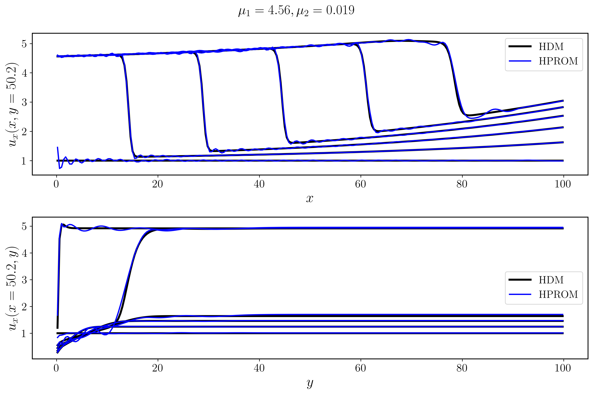
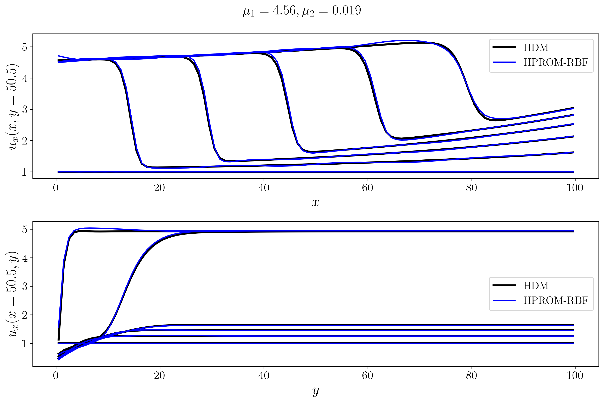
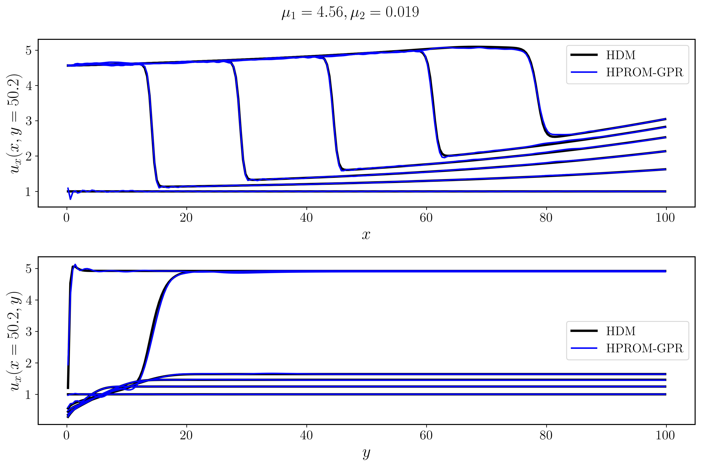
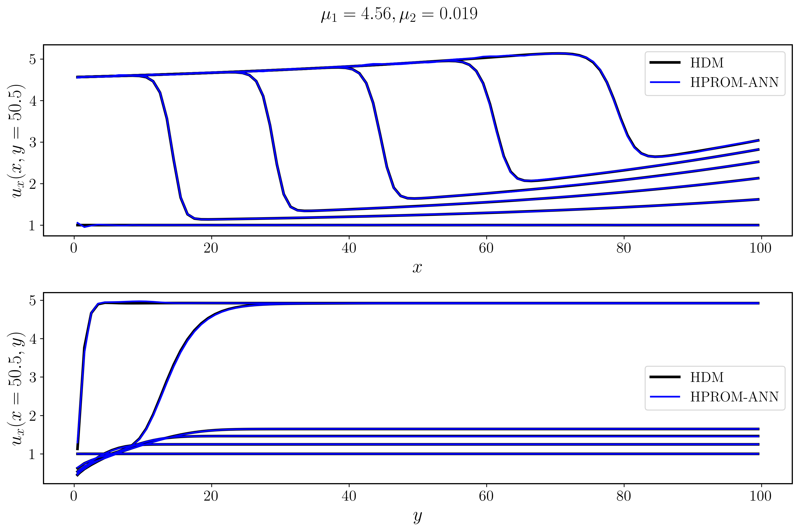
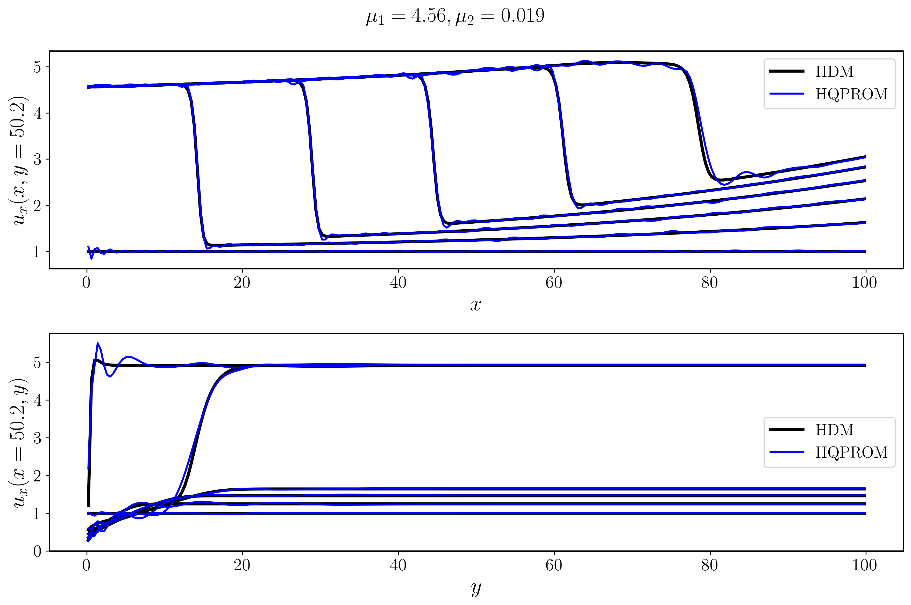
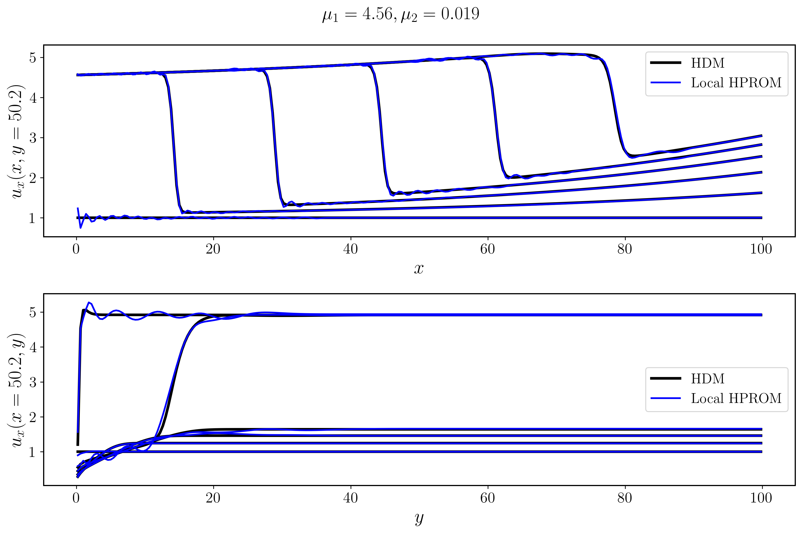
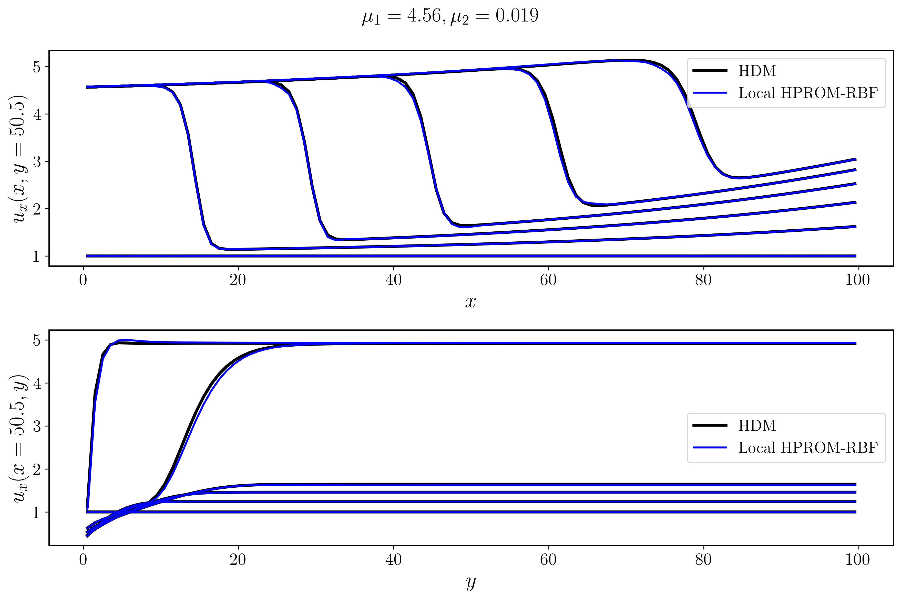
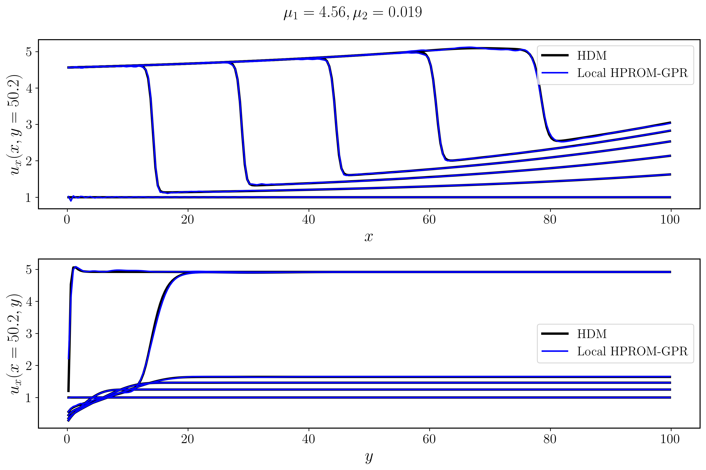
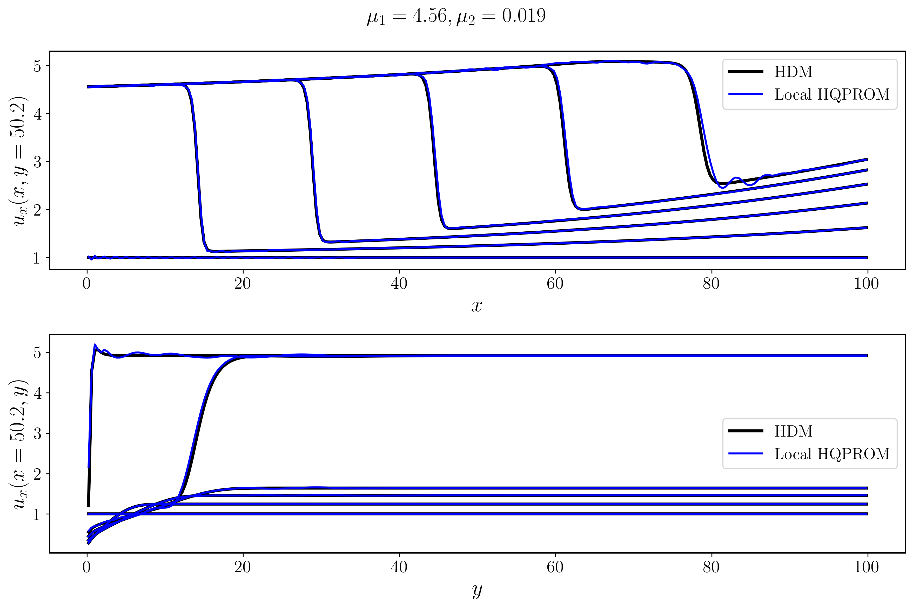

# BurgersFD
A high-level workflow guide for this repository.

## What this project is
This repository solves the **2D inviscid Burgers equations** on a fixed Cartesian grid, and builds multiple reduced-order models (ROMs) on top of the full-order model (FOM/HDM).

At a high level:
1. Generate or load HDM snapshots for a training parameter set.
2. Build a reduced representation (POD / local POD / quadratic manifold / POD+ML).
3. Run online prediction with PROM (full residual) or HPROM (hyper-reduced ECSW residual).
4. Save outputs (`.npy`, `.png`, `.txt`) for traceability.

## Core problem setup
Global constants are defined in `burgers/config.py`:
- `DT = 0.05`
- `NUM_STEPS = 500`
- `NUM_CELLS = 100` (so state size is `2 * 100 * 100 = 20000`)
- Default training parameter box: `mu1 in [4.25, 5.5]`, `mu2 in [0.015, 0.03]`
- Default `samples_per_mu=3` per axis (`3x3 = 9` parameter points)

The default training grid is generated by `burgers.core.get_snapshot_params()`.

## Repository logic (big picture)
- `burgers/`: numerical kernels, manifold models, Gauss-Newton solvers, ECSW tools.
- `run_fom_training.py`: explicit offline pre-generation of training HDM snapshots.
- `run_fom.py`: standalone HDM run for one parameter.
- Method folders (`POD`, `LocalPOD`, `Quadratic`, `POD-RBF`, `POD-GPR`, `POD-ANN`, local variants): staged offline pipelines.
- `run_*.py`: online runners that compare ROM vs HDM and save to `Results/`.

## First thing to run after a fresh clone
From repository root:

```bash
python3 run_fom_training.py
```

This populates `Results/param_snaps/` with HDM snapshots at the training parameters, and writes a summary in `Results/`.

Why this matters: almost every stage/runner reuses these cached snapshots.

## Standalone HDM run
To run a single HDM case (without ROM):

```bash
python3 run_fom.py
```

Use this when you want a clean full-order baseline for one `(mu1, mu2)`.

## Global linear POD workflow
1. Build POD basis:
```bash
python3 POD/stage1_build_pod_basis.py
```
2. POD diagnostics/reconstruction checks:
```bash
python3 POD/stage2_pod_diagnostics.py
```
3. Online PROM:
```bash
python3 run_prom.py
```
4. Online HPROM (ECSW):
```bash
python3 run_hprom.py --mu1 4.56 --mu2 0.019 --compute-ecsw
```

### `run_hprom.py` CLI quick reference
Common options:
- `--mu1`, `--mu2`: test parameter.
- `--num-modes`: truncation size of the POD basis (for example `151`).
- `--pod-dir`: POD artifact directory (default `POD`).
- `--results-dir`: output folder for snapshots/plots/summaries (default `Results`).
- `--compute-ecsw` / `--no-compute-ecsw`: build ECSW weights or reuse existing ones.

Example 3-point linear HPROM campaign (reusing existing ECSW weights):
```bash
python3 run_hprom.py --mu1 4.56 --mu2 0.019 --num-modes 151 --results-dir Results_250x250_Paper --no-compute-ecsw
python3 run_hprom.py --mu1 4.75 --mu2 0.020 --num-modes 151 --results-dir Results_250x250_Paper --no-compute-ecsw
python3 run_hprom.py --mu1 5.19 --mu2 0.026 --num-modes 151 --results-dir Results_250x250_Paper --no-compute-ecsw
```

Optional max-error extraction over those 3 summaries:
```bash
python3 - <<'PY'
from pathlib import Path
import re

base = Path("Results_250x250_Paper")
cases = [(4.56, 0.019), (4.75, 0.020), (5.19, 0.026)]
vals = []
for mu1, mu2 in cases:
    p = base / f"hprom_summary_mu1_{mu1:.2f}_mu2_{mu2:.3f}.txt"
    txt = p.read_text()
    err = float(re.search(r"relative_error_percent:\s*([0-9eE+\-.]+)", txt).group(1))
    vals.append((mu1, mu2, err))
    print(f"{mu1:.2f}, {mu2:.3f} -> {err:.6f}%")
mx = max(vals, key=lambda x: x[2])
print(f"MAX relative_error_percent = {mx[2]:.6f}% at ({mx[0]:.2f}, {mx[1]:.3f})")
PY
```

## Local POD workflow
1. Offline local clustering + local bases:
```bash
python3 LocalPOD/stage1_local_pod_offline_cheap.py
```
2. Offline projection/check stage:
```bash
python3 LocalPOD/stage2_local_pod_projection_cheap.py
```
3. Online local PROM / HPROM:
```bash
python3 run_local_prom.py
python3 run_local_hprom.py
```

## Quadratic manifold workflow
1. Offline manifold build:
```bash
python3 Quadratic/stage1_quadratic_offline.py
```
2. Projection/test stage:
```bash
python3 Quadratic/stage2_quadratic_projection.py
```
3. Optional tangent consistency check:
```bash
python3 Quadratic/stage_check_qm_tangent.py
```
4. Online QPROM / HQPROM:
```bash
python3 run_qprom.py
python3 run_hqprom.py
```

## Local quadratic manifold workflow
1. Offline local quadratic manifold:
```bash
python3 LocalQuadratic/stage1_local_qm_offline.py
```
2. Projection/test stage:
```bash
python3 LocalQuadratic/stage2_local_qm_projection.py
```
3. Online local QPROM / local HQPROM:
```bash
python3 run_local_qprom.py
python3 run_local_hqprom.py
```

### Local HQPROM sweep launcher
To sweep multiple `(zeta_qua, alpha_ridge)` candidates without editing files manually:
```bash
python3 launch_local_hqprom_sweep.py
```

Useful options:
```bash
# custom candidate lists
python3 launch_local_hqprom_sweep.py --zetas "0.2,0.5,0.8" --ridge-alphas "1e-4,1,1e4"

# custom output folder and explicit test points
python3 launch_local_hqprom_sweep.py \
  --root-dir LocalQuadraticSweep/local_hqprom_sweep_paper \
  --points "4.56,0.019;4.75,0.020;5.19,0.026"

# force rerun even if summary.csv already has status=ok rows
python3 launch_local_hqprom_sweep.py --force
```

Notes:
- The script builds the global snapshot matrix and clustering once, then loops candidates.
- It writes per-candidate artifacts under `LocalQuadraticSweep/.../<tag>/` and appends to `summary.csv`.
- Resume behavior: by default it skips candidates already marked as `status=ok` in `summary.csv`.

## POD-RBF workflow
1. POD basis:
```bash
python3 POD-RBF/stage1_build_pod_basis.py
```
2. Project snapshots to reduced coordinates:
```bash
python3 POD-RBF/stage2_project_training_data.py
```
3. Train RBF map (choose one Stage 3 option):
- Grid search (deterministic):
```bash
python3 POD-RBF/stage3_train_rbf_grid_search.py
```
- Bayesian optimization (fewer evaluations, optional):
```bash
python3 POD-RBF/stage3_train_rbf_bayesian.py
```
Both Stage 3 options produce the same model artifacts in `POD-RBF/pod_rbf_model/`
(`rbf_weights.pkl`, `scaler.pkl`, `U_p.npy`, `U_s.npy`, `u_ref.npy`, etc.), so Stage 4
and `run_prom_rbf.py` / `run_hprom_rbf.py` work with either one.
4. Test reconstruction:
```bash
python3 POD-RBF/stage4_test_rbf.py
```
5. Online PROM / HPROM:
```bash
python3 run_prom_rbf.py
python3 run_hprom_rbf.py
```

### Local POD-RBF workflow
- Offline stages:
```bash
python3 LocalPOD-RBF/stage1_cluster_snapshots_u.py
python3 LocalPOD-RBF/stage2_local_pod_per_cluster.py
python3 LocalPOD-RBF/stage3_local_project_to_q.py
python3 LocalPOD-RBF/stage4_local_pod_rbf_training_grid_search.py
# Optional Bayesian alternative for Stage 4:
# python3 LocalPOD-RBF/stage4_local_pod_rbf_training_bayesian.py
python3 LocalPOD-RBF/stage5_local_pod_rbf_projection.py
```
- Online:
```bash
python3 run_local_prom_rbf.py
python3 run_local_hprom_rbf.py
```

## POD-GPR workflow
1. POD basis:
```bash
python3 POD-GPR/stage1_build_pod_basis.py
```
2. Project snapshots:
```bash
python3 POD-GPR/stage2_project_training_data.py
```
3. Train GPR map:
```bash
python3 POD-GPR/stage3_train_gpr.py
```
4. Test reconstruction:
```bash
python3 POD-GPR/stage4_test_gpr.py
```
5. Online PROM / HPROM:
```bash
python3 run_prom_gpr.py
python3 run_hprom_gpr.py
```

### Local POD-GPR workflow
- Offline stages:
```bash
python3 LocalPOD-GPR/stage1_cluster_snapshots_u.py
python3 LocalPOD-GPR/stage2_local_pod_per_cluster.py
python3 LocalPOD-GPR/stage3_local_project_to_q.py
python3 LocalPOD-GPR/stage4_local_pod_gpr_training.py
python3 LocalPOD-GPR/stage5_local_pod_gpr_projection.py
```
- Online:
```bash
python3 run_local_prom_gpr.py
python3 run_local_hprom_gpr.py
```

## POD-ANN workflow
1. POD basis:
```bash
python3 POD-ANN/stage1_build_pod_basis.py
```
2. Project snapshots:
```bash
python3 POD-ANN/stage2_project_training_data.py
```
3. Train ANN map (`q_s = N(q_p)`, scaling embedded in `.pt`):
```bash
python3 POD-ANN/stage3_train_ann.py
```
4. Test reconstruction:
```bash
python3 POD-ANN/stage4_test_ann.py
```
5. Online PROM / HPROM:
```bash
python3 run_prom_ann.py
python3 run_hprom_ann.py
```

## POD-DL workflow
TODO: rename `pod_dl` to `pod_ae` consistently across scripts, file names, and paths (deferred for now).

1. POD basis:
```bash
python3 POD-DL/stage1_build_pod_basis.py
```
2. Project snapshots to a single POD coefficient space `q`:
```bash
python3 POD-DL/stage2_project_training_data.py
```
3. Train POD-level autoencoder (`q -> z -> q`, with scaling embedded in model):
```bash
python3 POD-DL/stage3_train_autoencoder.py
```
4. Test reconstruction on a target parameter:
```bash
python3 POD-DL/stage4_test_autoencoder.py
```
5. Online PROM / HPROM:
```bash
python3 run_prom_dl.py
python3 run_hprom_dl.py
```

`run_hprom_dl.py` follows the same ECSW logic as other HPROM runners: run once with
ECSW construction enabled, then reuse the saved weights in later runs.

## POD-GPLVM workflow
1. Ensure training HDM snapshots are available:
```bash
python3 run_fom_training.py
```
2. POD basis:
```bash
python3 POD-GPLVM/stage1_build_pod_basis.py
```
3. Project snapshots to POD coordinates:
```bash
python3 POD-GPLVM/stage2_project_training_data.py
```
4. Train POD-GPLVM in POD space (`q -> z -> q`):
```bash
python3 POD-GPLVM/stage3_train_gplvm.py
```
Default Stage 3 behavior:
- uses all training points (`max_train_samples=None`)
- enables bounded-validation inversion (`val_inverse_method="bounded_trf"`)
- builds a sparse decoder automatically when `n_train > sparse_num_inducing` (default `300`)
- uses restart logic if L-BFGS-B false-converges early

If you want to force sparse decoder + stronger restarts explicitly:
```bash
cd POD-GPLVM
python3 - <<'PY'
import stage3_train_gplvm as s
s.main(
    max_train_samples=None,
    sparse_decoder="on",
    sparse_num_inducing=400,
    auto_restart=True,
    max_restarts=3,
)
PY
```
5. Test reconstruction:
```bash
python3 POD-GPLVM/stage4_test_gplvm.py
```
Stage 4 now uses bounded multi-start `q -> z` inversion by default.

6. Online PROM:
```bash
python3 run_prom_gplvm.py
```
7. Online HPROM:
```bash
python3 run_hprom_gplvm.py
```

Online note: both `run_prom_gplvm.py` and `run_hprom_gplvm.py` use bounded multi-start
inverse solves for the initial latent state `z0` (and HPROM ECSW construction), consistent
with the Stage 4 inversion logic.

Current behavior note: `run_hprom_gplvm.py` calls `main(mu1=4.56, mu2=0.019,
compute_ecsw=True)` in `__main__`, so it rebuilds ECSW weights each time unless
you change that call.

## What to expect in outputs
Online `run_*.py` scripts generally save:
- snapshots (`*.npy`)
- HDM vs ROM comparison plots (`*.png`)
- run summary metadata (`*.txt`)

For manifold methods with extra reduced coordinates (for example POD-DL), runners may
also save latent/reduced trajectories (`*_latent_*.npy`).

By convention, these go to `Results/`.

## Example HPROM solutions (from current `Results/`)
These examples correspond to the test case:
- `mu1 = 4.56`
- `mu2 = 0.019`

Global HPROM images:
- 
- 
- 
- 
- 
- 

Local HPROM images:
- 
- 
- 
- 

Relative errors from the corresponding summary files (`relative_error_percent`):

| Method | Relative error [%] | Source |
|---|---:|---|
| HPROM (linear POD) | 4.04531730e-02 | `Results/hprom_summary_mu1_4.56_mu2_0.019.txt` |
| HPROM-RBF | 1.19956645e+00 | `Results/hprom_rbf_summary_mu1_4.56_mu2_0.019.txt` |
| HPROM-GPR | 3.39832583e+00 | `Results/hprom_gpr_summary_mu1_4.56_mu2_0.019.txt` |
| HPROM-ANN | 2.74196265e-01 | `Results/hprom_ann_summary_mu1_4.56_mu2_0.019.txt` |
| HPROM-DL | 2.97578744e-01 | `Results/hprom_dl_summary_mu1_4.56_mu2_0.019.txt` |
| HQPROM | 8.41366634e-01 | `Results/hqprom_summary_mu1_4.56_mu2_0.019.txt` |
| Local HPROM (linear POD) | 2.65814200e-02 | `Results/local_hprom_summary_mu1_4.56_mu2_0.019.txt` |
| Local HPROM-RBF | 8.63189208e-01 | `Results/local_hprom_rbf_summary_mu1_4.56_mu2_0.019.txt` |
| Local HPROM-GPR | 5.27792721e-01 | `Results/local_hprom_gpr_summary_mu1_4.56_mu2_0.019.txt` |
| Local HQPROM | 6.14310324e-01 | `Results/local_hqprom_summary_mu1_4.56_mu2_0.019.txt` |

## Practical usage notes
- Run scripts from repository root so relative paths resolve correctly.
- If a run is "slow", first check whether snapshots are being computed vs loaded from cache.
- HPROM (`run_hprom_*`) needs ECSW weights. If missing, rerun with ECSW construction enabled (`--compute-ecsw`) first.
- Many scripts support `u_ref` centering (`auto/on/off`). Keep this consistent with how the basis/model was trained.

## Minimal recommended memory refresher (4 months later)
If you only remember one sequence, use this:
1. `python3 run_fom_training.py`
2. Choose one method family (POD, POD-RBF, POD-GPR, POD-ANN, etc.)
3. Run its stage scripts in order (`stage1 -> stage2 -> ...`)
4. Run its online script (`run_prom_*` and optionally `run_hprom_*`)
5. Read the generated `.txt` summary in `Results/`
